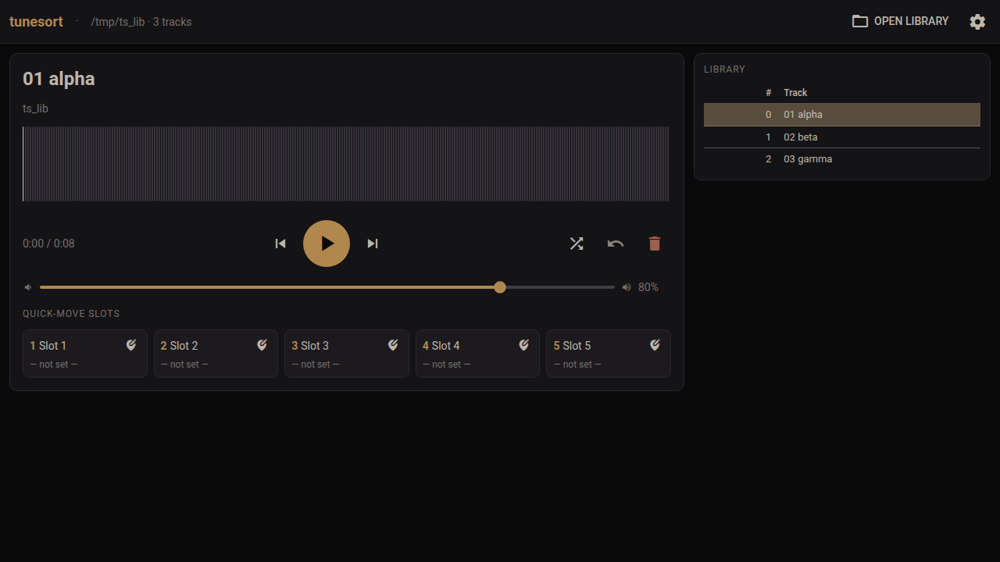

<!--tunesort-->


<picture><source media="(prefers-color-scheme: dark)" srcset="https://www.shieldcn.dev/github/last-commit/theelderemo/tunesort.svg?variant=secondary&size=sm&mode=dark"></picture>
<picture><source media="(prefers-color-scheme: dark)" srcset="https://www.shieldcn.dev/github/release/theelderemo/tunesort.svg?variant=ghost&size=sm&mode=dark"></picture>
<picture><source media="(prefers-color-scheme: dark)" srcset="https://www.shieldcn.dev/github/ci/theelderemo/tunesort.svg?variant=secondary&size=sm&mode=dark"></picture>
<picture><source media="(prefers-color-scheme: dark)" srcset="https://www.shieldcn.dev/github/license/theelderemo/tunesort.svg?variant=ghost&size=sm&mode=dark"></picture>


A lightweight, **dark**, keyboard-driven music sorter for triaging large
libraries. Point it at a folder, then shuffle, audition, **delete to trash**,
and **quick-move** tracks into target folders without ever lifting your hands
off the keyboard. Built as a native **GTK4 / GStreamer** application - one small
binary, no Electron, no embedded browser.

The palette is deliberately warm and very dark: easy on the eyes at night, dim
enough to leave running while you fall asleep (as I tend to do this before bed, lol), but every control stays legible.
Everything - colours, settings, keybindings, quick-move slots - is editable
inside the app *and* in a single persistent config file, in the spirit of mpv.



## Features

- **Load a library** via the folder picker or a path argument (recurses into
  subfolders by default).
- **Shuffle** the whole library, keeping the current track playing.
- **Delete → OS trash**, never a permanent unlink. Press `D`; **undo** with `U`.
- **Quick-move slots** - pin a target folder to each slot, then move the playing
  file there instantly with the number keys. Configurable from **1 to 9 slots**;
  assign a folder with `Ctrl`+number or the pencil button on each slot.
- **Right-click "Move to…"** - right-click the player or any track in the list
  to move it to a quick slot, a **recent destination**, or any folder you browse
  to. Recent destinations are remembered automatically (the count is
  configurable).
- **Multi-level undo** for deletes *and* moves (`U` / `Ctrl`+`Z`). Trashed files
  are pulled back out of the freedesktop trash; moved files are returned.
- **Waveform + scrubbing** - peaks are extracted with GStreamer and drawn with
  Cairo; click or drag anywhere on the wave to seek. `J`/`L` seek back/forward.
- **Auto-advance** to the next track when one ends (toggleable).
- **Optional visualizer** with several muted themes (`V`), fed by GStreamer's
  `spectrum` element.
- **Metadata (ID3/tag) editing** - tags are read always; editing is **off by
  default** and enabled with a settings toggle (`E`). Powered by `lofty` for
  audio formats and `midly` for MIDI (title maps to the MIDI TrackName
  meta-event). Works across formats, including `.mid`/`.midi`.
- **MIDI support** - `.mid` and `.midi` files load and play back via GStreamer's
  MIDI synth pipeline. Format, track count, BPM, time signature, key, and
  instrument names appear in the player subtitle when present in the file. The
  waveform display shows a note density graph so you can still scrub through
  the track.
- **Everything is configurable** - General / Keybindings / Quick slots / Theme
  tabs, plus a raw **Config file** editor for total control. Rebind *any* action
  to *any* key; codes are physical-key based, so layout and numpad keys behave
  predictably.
- **Handles all common audio formats** (mp3, flac, ogg, opus, wav, m4a/aac,
  aiff, wma, …) plus **MIDI** (`.mid`/`.midi`). Playback depends on the
  installed GStreamer plugins; file operations work regardless.

## Install

### Prebuilt binary (Linux x86_64)

Each [release](../../releases) includes a prebuilt `tunesort` binary for 64-bit
Linux (glibc), built on the latest Ubuntu. Download the tarball, verify it, and
drop the binary on your `PATH`:

```bash
tar -xzf tunesort-*-x86_64-linux.tar.gz
install -Dm755 tunesort ~/.local/bin/tunesort
```

> The prebuilt binary dynamically links GTK4, libadwaita and GStreamer, so you
> still need those **runtime** libraries installed (see below). Because it is
> built against one specific distro's library versions, it may not run on older
> or very different systems - **building from source is the recommended path**
> and the only one guaranteed to match your machine. Don't blindly trust a
> binary you didn't build; the `SHA256SUMS.txt` in each release lets you at
> least confirm you downloaded what was published.

Runtime libraries on Ubuntu / Debian:

```bash
sudo apt install libgtk-4-1 libadwaita-1-0 \
    gstreamer1.0-plugins-base gstreamer1.0-plugins-good \
    gstreamer1.0-plugins-bad gstreamer1.0-plugins-ugly gstreamer1.0-libav
```

### Build from source (recommended)

You need the [Rust toolchain](https://rustup.rs) plus the GTK4 / libadwaita /
GStreamer **development** packages. On Ubuntu / Debian:

```bash
sudo apt install build-essential libgtk-4-dev libadwaita-1-dev \
    libgstreamer1.0-dev libgstreamer-plugins-base1.0-dev \
    gstreamer1.0-plugins-good gstreamer1.0-plugins-bad \
    gstreamer1.0-plugins-ugly gstreamer1.0-libav

cargo build --release
install -Dm755 target/release/tunesort ~/.local/bin/tunesort
```

The GStreamer plugin packages are runtime dependencies for playback (the
`-good`/`-bad`/`-ugly`/`libav` sets between them cover mp3, aac/m4a, flac, ogg,
opus, wav and more).

## Run

```bash
tunesort                  # open the app
tunesort ~/Music          # load a library on start
```

## Default keybindings

| Key | Action | Key | Action |
|-----|--------|-----|--------|
| `Space` / `K` | Play / pause | `D` | Delete → trash |
| `→` | Next track | `S` | Shuffle |
| `←` | Previous track | `U` / `Ctrl`+`Z` | Undo last delete/move |
| `↑` / `↓` | Volume up / down | `O` | Open library |
| `L` / `J` | Seek forward / back | `,` | Settings |
| `M` | Mute | `V` | Toggle visualizer |
| `1`–`9` / numpad | Quick-move to slot | `E` | Toggle metadata editor |
| `Ctrl`+`1`–`9` (numpad) | Assign folder to slot | | |

All of these are remappable in **Settings → Keybindings**.

## Configuration

The config lives at `~/.config/tunesort/config.json` (or `$XDG_CONFIG_HOME`).
It is written whenever you change something in the app, and re-read on launch.
You can edit it by hand, or from **Settings → Config file** - invalid JSON is
rejected, and unknown or missing keys are merged against the defaults so
upgrades never wipe your edits.

Top-level keys: `library_path`, `settings`, `theme`, `quickslots`,
`recent_destinations`, `keybindings`. The number of active quick slots
(`quickslot_count`) and how many recent destinations to remember
(`max_recent_destinations`) live under `settings`. See `src/config.rs` for the
full default set.

## How it works

- `src/config.rs` - load / save / merge of the JSON config.
- `src/library.rs` - scanning, shuffle, trash / move with a multi-level undo
  stack.
- `src/metadata.rs` - `lofty` tag read / write for audio; `midly` tag read /
  write for MIDI (reads TrackName, Tempo, KeySignature and more for display;
  writes TrackName for the editable title field).
- `src/player.rs` - a GStreamer `playbin` wrapper for playback, async waveform
  peak extraction, MIDI note-density waveform fallback, and the
  `spectrum`-fed visualizer.
- `src/ui.rs` - the GTK4 UI, the action registry, and keyboard dispatch.
- `src/main.rs` - entry point and application bootstrap.

## License

APACHE 2.0 - see [LICENSE](LICENSE).
